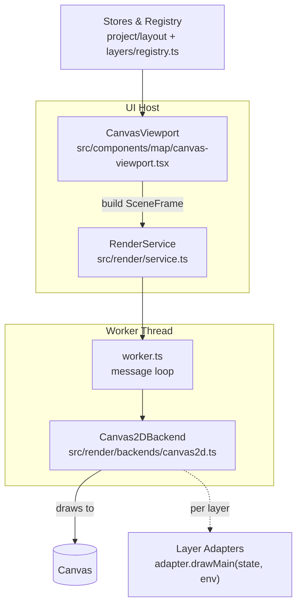

# Render Pipeline — Single Source of Truth

Updated: 2025-09-05

This document is the authoritative reference for how frames are produced and rendered. It links ADRs and code so product, plugin authors, and implementers share the same mental model.

## Overview

- Host assembles a `SceneFrame` and sends it to a worker-based renderer (OffscreenCanvas). A main-thread fallback is used if workers aren’t available.
- Paper acts as the visual frame. Non-paper layers render inside a clipped region and optional camera transform.
- Layer adapters draw; the host owns layout math, clipping, and camera.



## Data Model (Types)

- `SceneFrame`: `{ size, pixelRatio, paper, camera, layers[] }` — see `src/render/types.ts`.
- `RenderBackend`: `{ init, resize, render, destroy }` — pluggable backends.
- `RenderEnv` (adapter input): `{ size, paperRect, camera, pixelRatio, zoom, grid? }` — see `src/layers/types.ts`.

## Host Responsibilities

- Compute `paperRect` from viewport and paper aspect; draw paper fill (screen space).
- Clip to `paperRect`; translate to paper origin; apply camera (future: pan/zoom).
- Iterate visible layers in array order bottom→top; call `adapter.drawMain(ctx, state, env)`.
- Do not inspect adapter state beyond the invalidation contract.

Reference: `src/components/map/canvas-viewport.tsx`, `src/render/backends/canvas2d.ts`.

## Adapter Contract (Required)

- `getInvalidationKey(state: State): string` — required. Must be deterministic and change only when visuals change.
- `drawMain(ctx, state, env)` — render inside `env.size` with origin at `paperRect.topLeft` (after host transform).
- Optional: `hitTest`, `drawSceneView`, `serialize/deserialize`.

Reference: `src/layers/types.ts`, built-ins under `src/layers/adapters/*`.

## Invalidation & Redraw

- The host computes a stable `layersKey`:
  - `layerKey = \`${type}:${visible ? '1' : '0'}:${adapter.getInvalidationKey(state)}\``
  - `layersKey = visibleLayers.map(layerKey).join('|')`
- Any change to paper aspect/color, canvas dimensions, camera, or `layersKey` triggers a render.
- No fallback to `JSON.stringify(state)`; misconfigured adapters throw at runtime.

Reference: `guidance/adrs/0002-plugin-architecture.md` (Render Invalidation & Redraw Contracts), `canvas-viewport.tsx`.

## Ordering & Anchors

- Array order is render order (bottom→top). Canonical anchors:
  - Bottom: `paper` (non-deletable, single instance)
  - Top: `hexgrid` (non-deletable, single instance)
- Other layers insert between anchors. Backends must not reorder.

Reference: `guidance/adrs/0013-canonical-layer-order-and-anchors.md`.

## Worker vs Fallback

- Preferred: OffscreenCanvas worker (`RenderService` → `worker.ts` → `Canvas2DBackend`).
- Fallback: main-thread renderer in `CanvasViewport` mirrors the same math and order for parity.

Reference: `src/render/service.ts`, `src/render/worker.ts`, fallback path in `canvas-viewport.tsx`.

## Testing Hooks

- Unit/integration validate adapter keys and host contract.
- E2E probe toggles Hex Grid properties and asserts canvas changes.
- CI run: `CI=1 PORT=3211 pnpm test:e2e`.

Reference: `src/test/invalidation-keys.test.ts`, `src/test/invalidation-contract-canvas-viewport.test.tsx`, `src/test/e2e/invalidation-redraw.spec.ts`.

## Future Extensions

- Backend abstraction (ADR‑0011): optional WebGL2/Pixi backend for batching, masks, post‑fx.
- Camera interactions (zoom/pan), region-based invalidation, and hit-testing via AppAPI.

## ADR Links

- ADR‑0007 Layer Rendering Pipeline and Masking
- ADR‑0011 Render Backend Abstraction
- ADR‑0002 Plugin Architecture (Invalidation Contract)

```
- guidance/adrs/0007-layer-rendering-pipeline-and-masking.md
- guidance/adrs/0011-render-backend-abstraction.md
- guidance/adrs/0002-plugin-architecture.md
```
